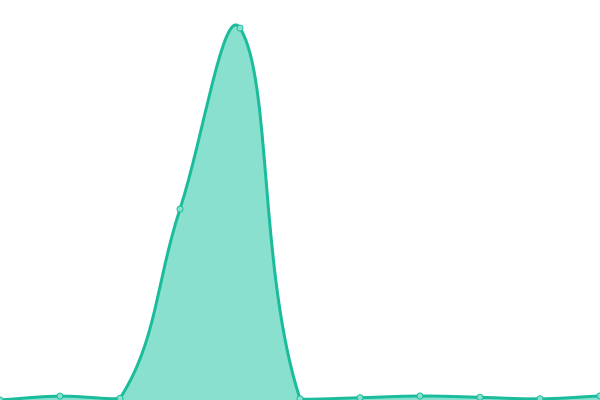

# [📈 Live Status](https://PaoMian0806.github.io/Wikidot-Upptime-Status): <!--live status--> **🟩 All systems operational**

這是一個可以即時顯示 Wikidot 網站運行狀況的頁面，以[Upptime](https://github.com/upptime/upptime)這個開源網站監測專案為基底去設置，目前由[Pao Mian](https://github.com/PaoMian0806)本人託管並維護。目前本頁收錄了 Wikidot 主頁、部分的 SCP Wiki 國際站以及 Backrooms Wiki，之後可能會添加其他網站。

關於 Upptime 的主要功能，請見[官方網頁](https://upptime.js.org)。

你可以在本頁的[Actions](https://github.com/PaoMian0806/Wikidot-Upptime-Status/actions)中查看每個網站的詳細監測資訊，或是直接前往[監測網站](https://PaoMian0806.github.io/Wikidot-Upptime-Status)上觀看。若在使用上有任何疑問，可透過本頁的[Issues](https://github.com/PaoMian0806/Wikidot-Upptime-Status/issues)向我回報問題。

<!--start: status pages-->
<!-- This summary is generated by Upptime (https://github.com/upptime/upptime) -->
<!-- Do not edit this manually, your changes will be overwritten -->
<!-- prettier-ignore -->
| URL | Status | History | Response Time | Uptime |
| --- | ------ | ------- | ------------- | ------ |
|  [Wikidot](https://www.wikidot.com) | 🟩 Up | [wikidot.yml](https://github.com/PaoMian0806/Wikidot-Upptime-Status/commits/HEAD/history/wikidot.yml) | 

 267ms
     
 | 

<a href="https://PaoMian0806.github.io/Wikidot-Upptime-Status/history/wikidot">99.53%</a>
    

|  [SCP-ZHTR](http://scp-zh-tr.wikidot.com) | 🟩 Up | [scp-zhtr.yml](https://github.com/PaoMian0806/Wikidot-Upptime-Status/commits/HEAD/history/scp-zhtr.yml) | 

 495ms
     
 | 

<a href="https://PaoMian0806.github.io/Wikidot-Upptime-Status/history/scp-zhtr">100.00%</a>
    

|  [SCP-EN](https://scp-wiki.wikidot.com) | 🟩 Up | [scp-en.yml](https://github.com/PaoMian0806/Wikidot-Upptime-Status/commits/HEAD/history/scp-en.yml) | 

 310ms
     
 | 

<a href="https://PaoMian0806.github.io/Wikidot-Upptime-Status/history/scp-en">100.00%</a>
    

|  [SCP-JP](http://scp-jp.wikidot.com) | 🟩 Up | [scp-jp.yml](https://github.com/PaoMian0806/Wikidot-Upptime-Status/commits/HEAD/history/scp-jp.yml) | 

 234ms
     
 | 

<a href="https://PaoMian0806.github.io/Wikidot-Upptime-Status/history/scp-jp">100.00%</a>
    

|  [Backrooms](http://backrooms-wiki.wikidot.com) | 🟩 Up | [backrooms.yml](https://github.com/PaoMian0806/Wikidot-Upptime-Status/commits/HEAD/history/backrooms.yml) | 

 232ms
     
 | 

<a href="https://PaoMian0806.github.io/Wikidot-Upptime-Status/history/backrooms">100.00%</a>
    

<!--end: status pages-->

[**前往監測用網頁 →**](https://PaoMian0806.github.io/Wikidot-Upptime-Status)

## 📄 License - 著作權說明

- Powered by： [Upptime](https://github.com/upptime/upptime)
- Code： [MIT](./LICENSE) © [PaoMian](https://PaoMian0806.github.io/Wikidot-Upptime-Status)
- Data in the `./history` directory： [Open Database License](https://opendatacommons.org/licenses/odbl/1-0/)

> MIT 開源許可協議（MIT License）
>
> 版權所有 (c) 2020，Anand Chowdhary。
>
> 特此向任何得到本軟件副本或相關文件的人授權： 被授權人有權使用、複製、修改、 合併、出版、發佈、散佈、 再授權和/或販售軟件及軟件的副本，及授予被供應人同等權利， 只需服從以下義務：
>
> 在軟件和軟件的所有副本中都必須包含以上版權聲明和本許可聲明。
>
> 該 軟 件 是 「按 原 樣」 提 供 的 ， 沒 有 任 何 形 式 的 明 示 或 暗 示 ， 包 括 但 不 限 於 為 特 定 目 的 和 不 侵 權 的 適 銷 性 和 適 用 性 的 保 證 擔 保 。 在 任 何 情 況 下 ， 作 者 或 版 權 持 有 人 ， 都 無 權 要 求 任 何 索 賠 ， 或 有 關 損 害 賠 償 的 其 他 責 任 。 無 論 在 本 軟 件 的 使 用 上 或 其 他 買 賣 交 易 中 ， 是 否 涉 及 合 同 ， 侵 權 或 其 他 行 為 。
