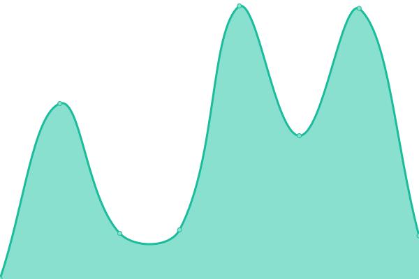

# [📈 Live Status](https://PaoMian0806.github.io/Pao-Upptime-Test): <!--live status--> **🟩 All systems operational**

This repository contains the open-source uptime monitor and status page for [PaoMian](https://PaoMian0806.github.io/Pao-Upptime-Test), powered by [Upptime](https://github.com/upptime/upptime).

With [Upptime](https://upptime.js.org), you can get your own unlimited and free uptime monitor and status page, powered entirely by a GitHub repository. We use [Issues](https://github.com/PaoMian0806/Pao-Upptime-Test/issues) as incident reports, [Actions](https://github.com/PaoMian0806/Pao-Upptime-Test/actions) as uptime monitors, and [Pages](https://PaoMian0806.github.io/Pao-Upptime-Test) for the status page.

<!--start: status pages-->
<!-- This summary is generated by Upptime (https://github.com/upptime/upptime) -->
<!-- Do not edit this manually, your changes will be overwritten -->
<!-- prettier-ignore -->
| URL | Status | History | Response Time | Uptime |
| --- | ------ | ------- | ------------- | ------ |
|  [Wikidot](https://www.wikidot.com) | 🟩 Up | [wikidot.yml](https://github.com/PaoMian0806/Pao-Upptime-Test/commits/HEAD/history/wikidot.yml) | 

 221ms
     
 | 

<a href="https://PaoMian0806.github.io/Pao-Upptime-Test/history/wikidot">100.00%</a>
    

|  [SCP-ZHTR](http://scp-zh-tr.wikidot.com) | 🟩 Up | [scp-zhtr.yml](https://github.com/PaoMian0806/Pao-Upptime-Test/commits/HEAD/history/scp-zhtr.yml) | 

 436ms
     
 | 

<a href="https://PaoMian0806.github.io/Pao-Upptime-Test/history/scp-zhtr">100.00%</a>
    

|  [SCP-EN](https://scp-wiki.wikidot.com) | 🟩 Up | [scp-en.yml](https://github.com/PaoMian0806/Pao-Upptime-Test/commits/HEAD/history/scp-en.yml) | 

 370ms
     
 | 

<a href="https://PaoMian0806.github.io/Pao-Upptime-Test/history/scp-en">100.00%</a>
    

|  [SCP-JP](http://scp-jp.wikidot.com) | 🟩 Up | [scp-jp.yml](https://github.com/PaoMian0806/Pao-Upptime-Test/commits/HEAD/history/scp-jp.yml) | 

 290ms
     
 | 

<a href="https://PaoMian0806.github.io/Pao-Upptime-Test/history/scp-jp">100.00%</a>
    

|  [Backrooms](http://backrooms-wiki.wikidot.com) | 🟩 Up | [backrooms.yml](https://github.com/PaoMian0806/Pao-Upptime-Test/commits/HEAD/history/backrooms.yml) | 

 448ms
     
 | 

<a href="https://PaoMian0806.github.io/Pao-Upptime-Test/history/backrooms">100.00%</a>
    

<!--end: status pages-->

[**Visit our status website →**](https://PaoMian0806.github.io/Pao-Upptime-Test)

## 📄 License

- Powered by: [Upptime](https://github.com/upptime/upptime)
- Code: [MIT](./LICENSE) © [PaoMian](https://PaoMian0806.github.io/Pao-Upptime-Test)
- Data in the `./history` directory: [Open Database License](https://opendatacommons.org/licenses/odbl/1-0/)
